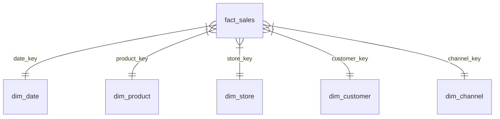

# Notes de schéma — NexaMart

> Diagrammes Mermaid, notes de design, évolution du schéma au fil des séances.

## S02 — Première étoile (fact_sales)

<!-- Mettez à jour ce diagramme au fil des séances -->
